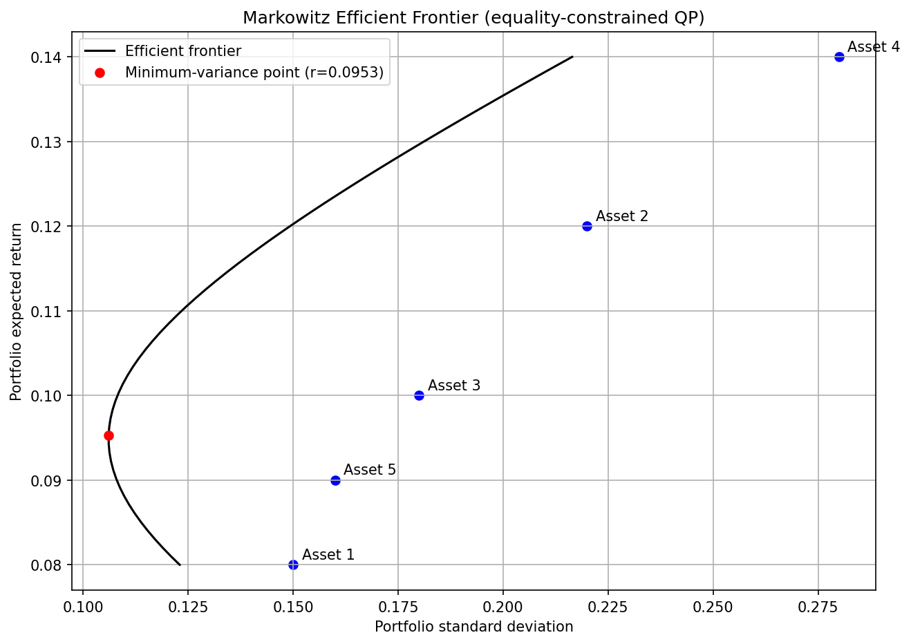
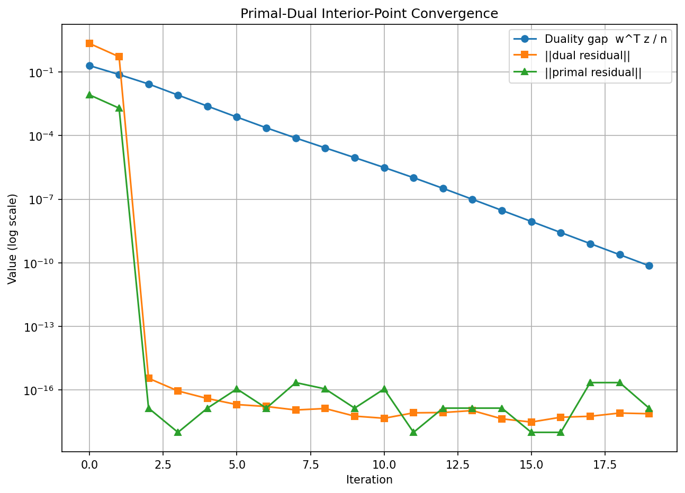
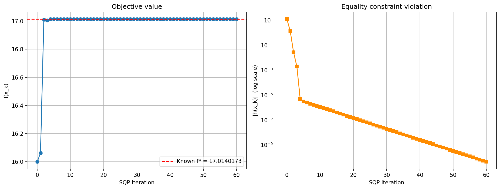

# Constrained Optimization: QP, Interior-Point, and SQP

Three notebooks covering quadratic programming and nonlinear constrained optimization, applied to
portfolio construction and a classical nonlinear test problem.

## Notebooks

| Notebook | Covers |
|---|---|
| [`quadratic_programming.ipynb`](quadratic_programming.ipynb) | Mean-variance portfolio optimization (equality-constrained QP), solved directly via the KKT linear system |
| [`interior_point_method.ipynb`](interior_point_method.ipynb) | The same portfolio problem with a long-only (`w >= 0`) constraint, solved with a primal-dual interior-point method |
| [`sequential_quadratic_programming.ipynb`](sequential_quadratic_programming.ipynb) | Hock-Schittkowski problem 71, solved with SQP using an interior-point QP subproblem solver |

## Files

| File | Contents |
|---|---|
| `quadratic_programming.ipynb` | Mean-variance QP, efficient frontier, plot |
| `interior_point_method.ipynb` | Long-only interior-point solve, convergence plot |
| `sequential_quadratic_programming.ipynb` | SQP on HS71, convergence plot |
| `markowitz_efficient_frontier.png` | Efficient frontier with the minimum-variance point marked |
| `interior_point_convergence.png` | Duality gap and residual norms vs. iteration |
| `sqp_convergence.png` | Objective value and constraint violation vs. iteration |

## How to build and run

Each notebook is self-contained: open it in Jupyter Notebook/Lab or VS Code and run all cells in
order. Requires `numpy` and `matplotlib`. All algorithms are implemented directly from their KKT
conditions — no calls to `scipy.optimize`, `cvxpy`, or any packaged QP/NLP solver for the core
method.

## Quadratic programming

Minimizes `(1/2) w^T Sigma w` subject to `w^T mu = r_target` and `w^T 1 = 1` for a 5-asset
synthetic universe, by assembling and solving the dense KKT linear system directly (no iteration
needed for an equality-only QP). Sweeping `r_target` over the feasible range traces the
Markowitz efficient frontier; the minimum-variance point falls at `r approx 0.0953`,
`std approx 0.1061`.



## Interior-point method

Adds a long-only constraint `w >= 0` to the same portfolio problem, which does introduce an
unknown active set and therefore requires iteration. A primal-dual interior-point method (log
barrier on the bound constraints, Newton steps on the perturbed KKT system, fraction-to-boundary
step control) drives the duality gap from `2e-1` to below `1e-10` in 19 iterations. At the
tested target return, the constraint activates on the lowest-return asset (its weight is driven
to exactly `0`), raising the achievable variance slightly above the unconstrained optimum
(`0.017851` vs. `0.017839`) — the expected effect of a binding inequality constraint.



## Sequential quadratic programming

Solves Hock-Schittkowski problem 71 —

```
minimize    x1*x4*(x1+x2+x3) + x3
subject to  x1*x2*x3*x4 >= 25,  x1^2+x2^2+x3^2+x4^2 = 40,  1 <= xi <= 5
```

— from the deliberately degenerate starting point `(1, 5, 5, 1)`, where every bound constraint
and the product inequality are already active but the equality constraint is violated by a wide
margin. Each SQP iteration builds a QP subproblem from the exact Hessian of the Lagrangian and
the linearized constraints, solves it with the same interior-point approach as the previous
notebook (extended to a general linear inequality via a slack variable), and globalizes the step
with a backtracking line search on the L1 exact penalty function. The iterates converge to
`f(x*) = 17.0140173`, matching the published optimum, with `x*` within `6e-5` of the reference
solution `(1, 4.7429994, 3.8211503, 1.3794082)`.



The constraint-violation panel's log scale makes the local quadratic convergence visible directly:
once the iterates are close enough to feasibility, each SQP step roughly squares the residual
rather than merely shrinking it by a fixed factor.

## Computational complexity

For a problem with $n$ decision variables and $m$ constraint rows, every method here reduces to
one or more dense linear solves of a KKT-type system, so the entire complexity story is in the
size of that system and how many times it must be solved.

**Quadratic programming** (equality-only): a single $(n+2)\times(n+2)$ dense linear solve,
$O(n^3)$, with no iteration — the KKT conditions of an equality-constrained QP are already
linear, so Newton's method converges in exactly one step. At $n=5$ this is negligible; the point
generalizes to any equality-constrained mean-variance problem regardless of the number of assets,
provided the covariance matrix itself is available (an $O(n^2)$ input, separate from the solve).

**Interior-point method**: adding the long-only inequality forces iteration. Each Newton step
solves a $(2n+m)\times(2n+m)$ system, $O(n^3)$ per step (here $n=5$, $m=2$, so a $12\times12$
solve). The observed 19 iterations to drive the duality gap from $2\times10^{-1}$ to below
$10^{-10}$ — nine orders of magnitude in fewer than 20 steps — is the expected signature of a
log-barrier interior-point method's local quadratic convergence once the iterates are safely
inside the central path; the total cost is $O(19\cdot n^3)$, not $O(n^3)$ per solve times a count
that grows with the target tolerance.

**Sequential quadratic programming**: each of the (here, well under 60) outer SQP iterations
builds and solves one QP subproblem of size $N=n+m_{\mathrm{eq}}+2m_{\mathrm{in}}$ via the same
interior-point machinery — for Hock-Schittkowski 71, $n=4$, $m_{\mathrm{eq}}=1$, $m_{\mathrm{in}}=9$,
so $N=23$ — at $O(N^3)$ per inner Newton step, nested inside the outer Newton-type iteration on
the nonlinear problem itself. This is why SQP is reserved for the regime where $n$ and the
constraint count are both modest and an exact (or Hessian-of-Lagrangian) second-order model is
affordable per outer step; at large $n$ the $O(N^3)$ inner solve, repeated every outer iteration,
is what motivates the first-order and quasi-Newton alternatives in
`first-order-and-quasi-newton-optimization/`.
