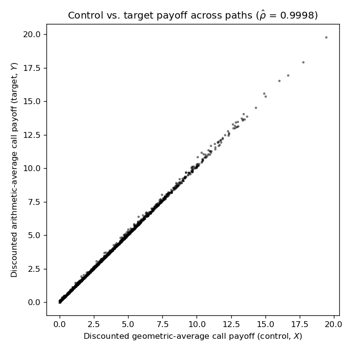

# Control Variates: Arithmetic Asian Options via a Tractable Geometric Control

## Problem

Price a European call on the arithmetic average of an underlying asset,
`Ā = (1/n)Σ S(t_i)`, under risk-neutral geometric Brownian motion
`dS = rS dt + σS dW`. A sum of correlated lognormals is not itself lognormal, so this option has
no closed form and must be priced by simulation. The call on the *geometric* average
`Ḡ = (Π S(t_i))^{1/n}` is tractable in closed form (Kemna–Vorst), since `log Ḡ` is a linear
combination of jointly Gaussian log-prices and is therefore Gaussian itself.

## Method

For a pair `(X, Y)` of simulation outputs with `E[X]` known, the control-variate estimator
`Ȳ(b) = Ȳ − b(X̄ − E[X])` is unbiased and consistent for every `b`, with variance minimized at
`b* = Cov[X,Y]/Var[X]`, giving a variance-reduction ratio of exactly `1 − ρ²_XY` relative to the
crude estimator. The geometric-average call is used as `X` and the arithmetic-average call as `Y`;
because both payoffs are monotone transforms of averages driven by the same Brownian path, and the
arithmetic and geometric mean of a set of positively correlated lognormals track each other closely,
`ρ_XY` is very close to 1.

The Kemna–Vorst closed form is derived directly in the notebook: for equally spaced monitoring dates,
`log Ḡ ~ N(μ_G, σ_G²)` with `σ_G² = σ²T(n+1)(2n+1)/(6n²)`, giving a Black–Scholes-type formula in the
lognormal parameters `(μ_G, σ_G²)` in place of the usual terminal ones.

The optimal coefficient `b*` is estimated from the simulated sample as the ordinary least-squares
slope of the arithmetic payoff on the geometric payoff, and the empirical variance-reduction factor is
checked directly against the theoretical `1/(1−ρ̂²)`.

## Computational complexity

The control-variate estimator costs `O(n_paths)` more than crude Monte Carlo — one extra
elementwise `log`/`mean`/`exp` pass to build the geometric-average payoff `X` from the *same*
simulated paths — with no additional random draws and no additional simulation. Estimating `b*`
from the sample covariance and variance of `X` and `Y` is likewise `O(n_paths)`, a single pass over
data already in memory. Since the variance-reduction factor `1/(1-rho^2)` (empirically `~2476x`
here, from `rho_hat ~ 0.9998`) is obtained at an `O(1)`-per-path cost overhead rather than an
`O(1)` overhead that must itself be amortized against the gain (contrast this with importance
sampling, where the drift shift `theta` must be chosen/tuned before simulating), this is close to
the most favorable case a variance-reduction technique can present: an essentially free
constant-factor cost increase purchasing a several-orders-of-magnitude reduction in the number of
paths needed for the same precision.

## Files

| File | Contents |
|---|---|
| `control_variates_asian_option.ipynb` | Kemna–Vorst closed form, crude vs. controlled Monte Carlo estimator, variance-reduction diagnostics |
| `control_variate_scatter.png` | Scatter of arithmetic vs. geometric discounted payoffs across simulated paths |

## How to build and run

Open `control_variates_asian_option.ipynb` in Jupyter Notebook/Lab or VS Code and run all cells in
order. Requires `numpy`, `scipy`, and `matplotlib`. Parameters (`r`, `σ`, `S0`, `T`, `K`, number of
monitoring dates) are set at the top of the parameter cell.

## Example output

For `r=0.05`, `σ=0.30`, `S0=50`, `T=0.25`, `K=50`, and 13 equally spaced monitoring dates (200,000
paths): sample correlation `ρ̂ ≈ 0.9998`, giving an empirical variance-reduction factor of
**≈ 2476×**, matching the theoretical `1/(1−ρ̂²)` exactly. The crude and controlled estimators agree
(1.987 vs. 1.983), but the controlled estimator's standard error is about 50× smaller, and the
simulated geometric-average price (1.935) matches the closed-form Kemna–Vorst price (1.931) to within
Monte Carlo noise.

The near-perfectly linear scatter of the arithmetic payoff against the geometric one is the visual
signature of `ρ̂ ≈ 0.9998`: a control variate this tightly correlated with the target is exactly
the regime in which the variance-reduction ratio `1/(1-ρ̂²)` blows up.
