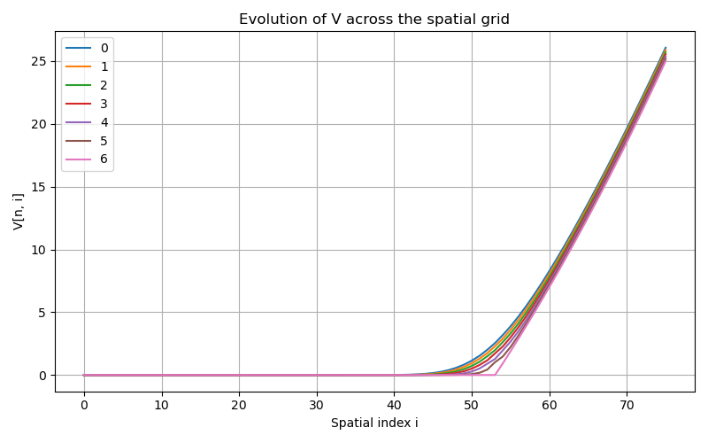
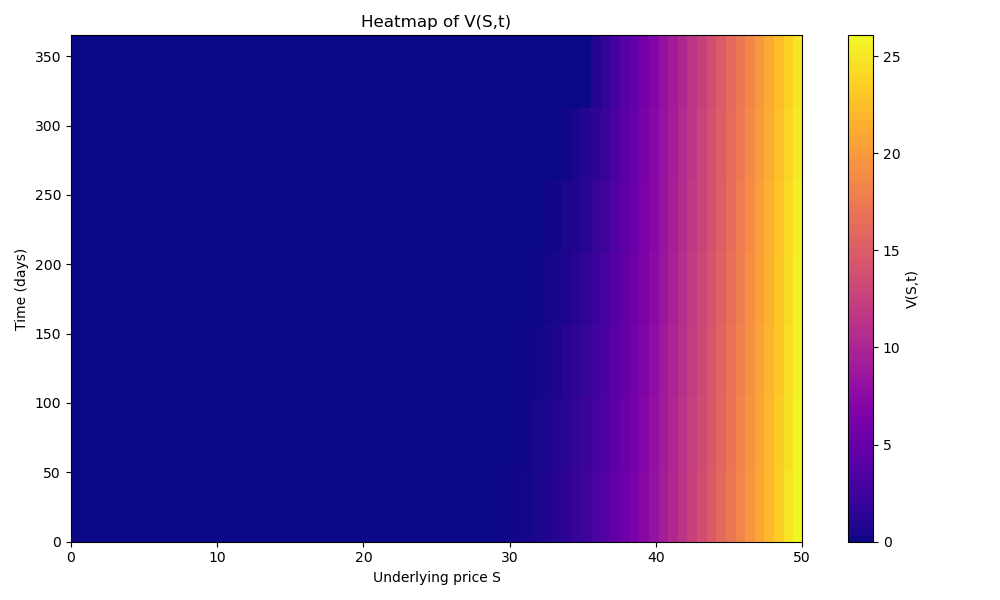

# Black-Scholes Option Pricing via Crank-Nicolson Finite Differences

## Problem

Price a European call option `V(S,t)` under the Black-Scholes PDE

```
∂V/∂t + ½σ²S²∂²V/∂S² + rS∂V/∂S − rV = 0
```

given volatility `σ`, risk-free rate `r`, strike `K`, and time to maturity `T`, on a non-uniform
spatial grid `S_i = S_max·(i/N)²` that concentrates nodes near `S=0`, where option value is most
sensitive to price changes.

## Method

The spatial operator `L(V) = ½σ²S²∂²V/∂S² + rS∂V/∂S − rV` is discretized with central differences
on the non-uniform grid, giving a tridiagonal operator `L(V)_i = α_i V_{i-1} + β_i V_i + γ_i V_{i+1}`
with coefficients derived from the local mesh spacing. Time-stepping uses **Crank-Nicolson**: the
spatial operator is averaged between the old and new time level,

```
V^{n+1} − (Δt/2)·L(V^{n+1}) = V^n + (Δt/2)·L(V^n)
```

which is solved as a tridiagonal linear system at every step (`scipy.linalg.solve_banded`), with
Dirichlet boundary rows pinned to their known values:

| | Terminal payoff | `V(0,t)` | `V(S_max,t)` |
|---|---|---|---|
| Call | `max(S-K, 0)` | `0` | `S_max - K e^{-r(T-t)}` |

Unlike an explicit scheme — whose time step is capped by a stability limit
`Δt < h_{i-1}h_i / (r h_{i-1} h_i + σ² S_i²)` — Crank-Nicolson is unconditionally stable, so a much
larger time step can be used safely. The notebook uses a step ten times past the explicit limit and
reports both the explicit limit and the step actually used.

## Computational complexity

Each Crank-Nicolson step solves a tridiagonal system of size `N+1` via `scipy.linalg.solve_banded`
— LAPACK's banded solver, which factors and back-substitutes a tridiagonal matrix in `O(N)`
arithmetic (three diagonals, no fill-in), rather than the `O(N^3)` a dense Gaussian-elimination
solve would cost if the banded structure were discarded. Over `M` time steps the total pricing
cost is `O(M \cdot N)`, linear in both grid resolution and time resolution — the reason
Crank-Nicolson's unconditional stability (letting `M` be chosen for accuracy alone, not to satisfy
an explicit-scheme stability bound) is a genuine efficiency win and not just a convenience: an
explicit scheme forced below `\Delta t_{\text{explicit}}` at the same `N` would need roughly `10x`
more time steps here, at the same `O(N)` per-step cost, for `10x` the total work.

The right-hand-side assembly at each step is `O(N)` work by construction (it touches each interior
grid point once), but the coefficients `\alpha_i,\beta_i,\gamma_i` depend only on the spatial grid
`S`, never on the time step `n` — so they are built once, outside the time loop, and the
per-step right-hand side is assembled as a single vectorized `numpy` expression over the interior
slice rather than an explicit `for i in range(1,N)` Python loop. Both forms perform the same
`O(M\cdot N)` floating-point operations; the vectorized form removes the Python-interpreter
overhead *per grid point per step* (`M\cdot(N-1)` individual interpreted loop iterations become
`M` vectorized calls), which is where a per-step Python loop actually loses time in practice, not
in its asymptotic complexity class — verified here to produce bit-identical output (`max abs
diff = 0.0`) against the original loop-based assembly before adopting it.

## Files

| File | Contents |
|---|---|
| `crank_nicolson_black_scholes.ipynb` | Grid setup, Crank-Nicolson solver, and plots |
| `black_scholes_grid_index.csv` | Option value `V[n, i]` at every time step `n` and spatial index `i` |
| `black_scholes_grid_S_t.csv` | Same grid, indexed by time in days and underlying price `S` |
| `black_scholes_grid_evolution.png` | `V` across the spatial grid at successive time steps |
| `black_scholes_heatmap.png` | Heatmap of `V(S,t)` over price and time |

## How to build and run

Open `crank_nicolson_black_scholes.ipynb` in Jupyter Notebook/Lab or VS Code and run all cells in
order. Requires `numpy`, `pandas`, `matplotlib`, and `scipy`. Parameters (`K`, `S_max`, `N`, `σ`,
`r`, `T`) are set at the top of the solver cell and can be edited directly to price a different
contract.

## Example output

For the example contract (`K=25`, `S_max=50`, `N=75`, `σ=0.20`, `r=0.0436`, `T=1.0`), the resulting
call value at `t=0` increases monotonically from `0` near `S=0` up to about `26.07` at `S=50` —
consistent with the intrinsic value `S_max - K = 25` plus roughly `1.07` of time value. The grid
evolution and heatmap plots show a smooth, non-oscillating value surface across the full price and
time range, as expected from an unconditionally stable scheme.





Both plots show the same qualitative feature from two angles: the value surface is smooth and
monotone in `S` at every time slice, with no spurious oscillation near the strike — the
signature of an unconditionally stable scheme, in contrast to the spurious oscillation an
under-resolved explicit or non-fitted scheme can produce near a kink in the terminal payoff.
