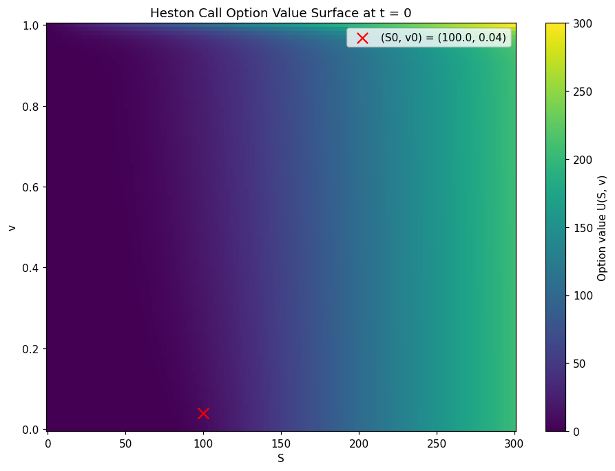
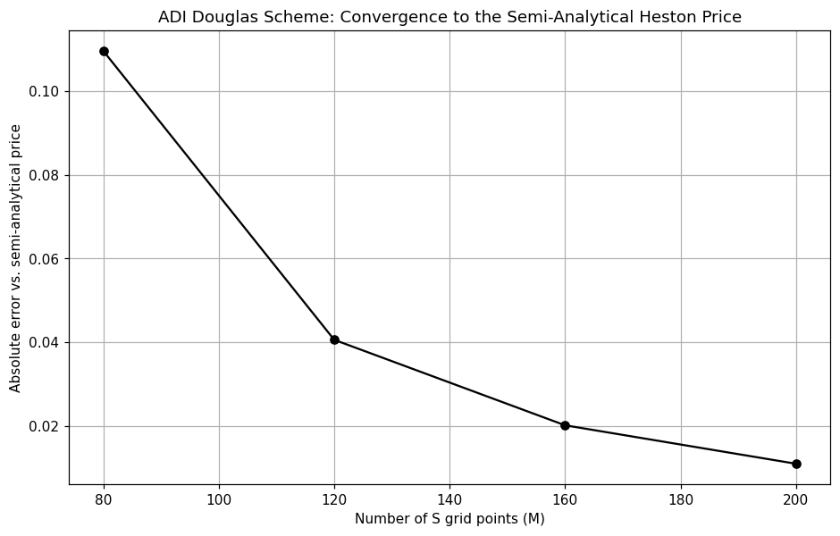

# Heston Stochastic-Volatility Option Pricing via ADI Crank-Nicolson

## Problem

Price a European call option `U(S,v,t)` under the Heston (1993) stochastic-volatility model

```
dS = r S dt + sqrt(v) S dW1
dv = kappa(theta - v) dt + sigma sqrt(v) dW2
corr(dW1, dW2) = rho
```

which gives the two-dimensional pricing PDE

```
dU/dt + (1/2) v S^2 d2U/dS2 + rho sigma v S d2U/dSdv + (1/2) sigma^2 v d2U/dv2
      + r S dU/dS + kappa(theta - v) dU/dv - r U = 0
```

with terminal payoff `U(S,v,T) = max(S-K, 0)`. Unlike Black-Scholes, this PDE has two spatial
dimensions (`S` and `v`) plus a cross-derivative term, so a direct (non-directional) implicit
scheme would require solving a dense 2D linear system at every time step.

## Method

**Reference price.** As an independent ground truth, the semi-analytical Heston price is computed
via its characteristic function (Little Trap formulation of Albrecher et al., 2007) and numerical
Fourier inversion:

```
C = S0*P1 - K*exp(-rT)*P2,   Pj = 1/2 + (1/pi) * Integral_0^inf Re[ exp(-i*u*ln K) * phi_j(u) / (i*u) ] du
```

This is checked against the closed-form Black-Scholes price in the limit `sigma -> 0`, `rho = 0`,
`theta = v0` (deterministic variance), where the two must agree exactly.

**PDE solver.** The spatial operator is split as `A = A0 + A1 + A2`: `A0` is the mixed `d2U/dSdv`
term, `A1` is the S-direction operator (`S`-diffusion, `S`-drift, half the discount), `A2` is the
v-direction operator (`v`-diffusion, mean-reverting `v`-drift, half the discount). Time-stepping
uses the **Douglas ADI scheme** (theta = 1/2, a directional Crank-Nicolson), following in 't Hout,
K.J. & Foulon, S. (2010), *ADI finite difference schemes for option pricing in the Heston model
with correlation*, Int. J. Numer. Anal. Model., 7(2), 303-320 (parameter Set 1 used below). Each
time step:

```
Y0 = U^n + dt * A(U^n)                         (explicit predictor, full operator)
(I - theta*dt*A1) Y1 = Y0 - theta*dt*A1(U^n)   (implicit correction, S-direction, tridiagonal per v-row)
(I - theta*dt*A2) Y2 = Y1 - theta*dt*A2(U^n)   (implicit correction, v-direction, tridiagonal per S-column)
U^{n+1} = Y2
```

Both implicit sub-steps are tridiagonal, since each is implicit in only one direction: the
`S`-sweep is `N+1` independent size-`(M+1)` systems (one per `v`-row), the `v`-sweep is `M-1`
independent size-`(N+1)` systems (one per interior `S`-column). Rather than dispatching
`scipy.linalg.solve_banded` once per row/column — `N+1` and `M-1` separate calls per time step,
each paying its own Python/LAPACK call overhead for a system of only a few hundred unknowns — both
sweeps are solved by a single hand-written, batched Thomas algorithm (`_thomas_batch`) that runs
the forward/backward elimination as a vectorized NumPy sweep across the entire batch of rows (or
columns) at once. This does not change the asymptotic cost (still exactly one O(size) elimination
per system, same as `solve_banded` would do), but it removes the fixed per-call dispatch overhead
that dominates at these system sizes, and every coefficient array that depends only on the
(fixed) grid and not on `U` or `tau` — `A1`, `A2`'s banded coefficients and their `theta`-scaled,
transposed forms used every step — is built once outside the time loop rather than recomputed at
each of the `num_steps` iterations. Uniform grids are used in both `S` and `v` for implementation
simplicity and robustness (a non-uniform grid concentrated near `S=K` and `v=0`, as in the
reference paper, would reach the same accuracy with fewer nodes, at the cost of a more involved
non-uniform stencil).

**Boundary conditions.** `U(0,v,t)=0`; `U(S_max,v,t) = S_max - K*exp(-r(T-t))`; `U(S,v_max,t) = S`
(the standard large-`v` approximation); at `v=0` the PDE degenerates (all `v`-scaled terms vanish),
so a one-sided forward difference in `v` is used there instead of dropping the boundary.

## Files

| File | Contents |
|---|---|
| `heston_adi_crank_nicolson.ipynb` | Semi-analytical reference price, ADI Douglas solver, convergence check, plots |
| `heston_adi_convergence.png` | Absolute error vs. grid resolution, checked against the semi-analytical price |
| `heston_value_surface.png` | Option value surface `U(S,v)` at `t=0` |

## How to build and run

Open `heston_adi_crank_nicolson.ipynb` in Jupyter Notebook/Lab or VS Code and run all cells in
order. Requires `numpy`, `matplotlib`, and `scipy`. Parameters (`kappa`, `theta_v`, `sigma`, `rho`,
`r`, `T`, `K`, `S0`, `v0`) are set at the top of the parameter cell and can be edited directly to
price a different contract.

## Example output

For the Set 1 parameters (`kappa=2`, `theta=0.04`, `sigma=0.3`, `rho=-0.5`, `r=0.03`, `T=1`,
`K=100`, `S0=100`, `v0=0.04`), the semi-analytical reference price is `9.2450`. The ADI solver
converges cleanly toward it as the grid is refined:

| Grid (`M`, `N`, steps) | Price | Absolute error | Relative error |
|---|---|---|---|
| 80, 40, 100 | 9.1355 | 0.1096 | 1.185% |
| 120, 60, 150 | 9.2044 | 0.0406 | 0.439% |
| 160, 80, 200 | 9.2249 | 0.0202 | 0.218% |
| 200, 100, 300 | 9.2340 | 0.0110 | 0.119% |

The value-surface plot shows a smooth, non-oscillating `U(S,v)` across the full price/variance
range, as expected from an unconditionally stable ADI scheme.





The convergence plot's error curve tracks the four grid resolutions in the table above, visually
confirming the monotone convergence toward the semi-analytical reference price as `(M,N,\text{steps})`
are refined together.

## Computational complexity and efficiency

Each time step costs `O(M*N)`: one full-grid evaluation of `A0+A1+A2` for the explicit predictor,
one batched Thomas sweep of `N+1` systems of size `M+1` (S-direction), and one batched Thomas
sweep of `M-1` systems of size `N+1` (v-direction) — each Thomas sweep is itself `O(size)` per
system, so `O(M*N)` total per direction, matching the lower bound of touching every grid point at
least once per step. Total cost for the finest grid tested (`M=200`, `N=100`, `300` time steps) is
`O(200*100*300) = 6*10^6` grid-point updates, executed as `300` vectorized batched-Thomas sweeps
per direction (`600` total) rather than `300*(101+199) = 90{,}000` separate
`scipy.linalg.solve_banded` dispatches — measured wall time for that run is **1.49 s** on this
machine. This is the entire point of the ADI splitting: a naive, non-directional 2D implicit
solve would require factoring a dense (or `O(MN)`-bandwidth sparse) `(M+1)(N+1)`-square system at
every step, `O((MN)^{1.5})` or worse depending on the sparse factorization used, instead of two
`O(MN)` tridiagonal sweeps.
