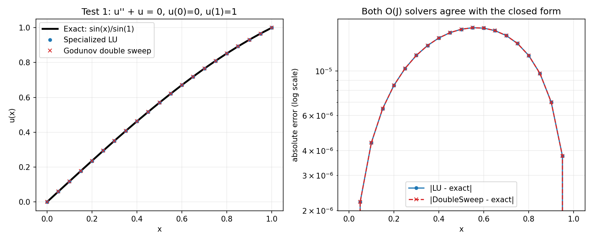
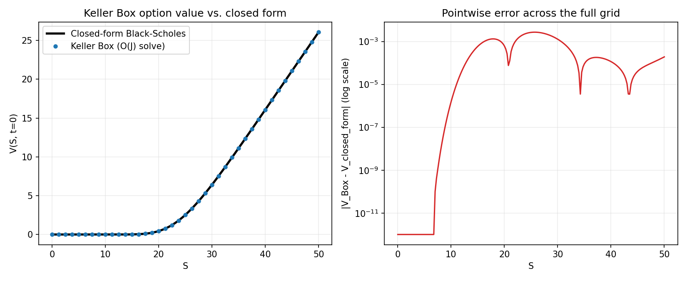
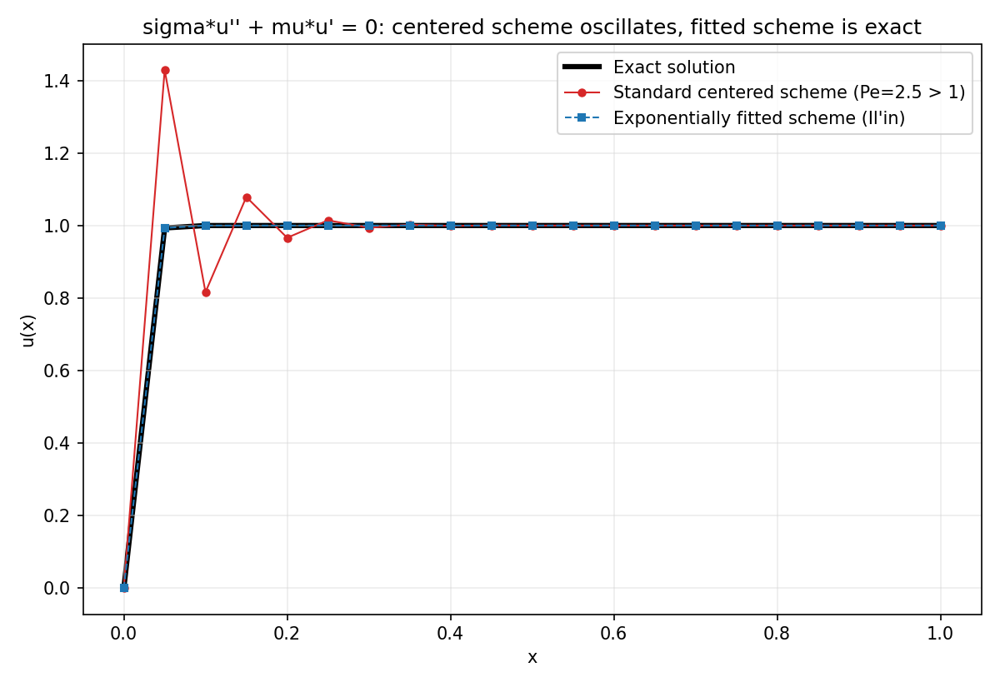
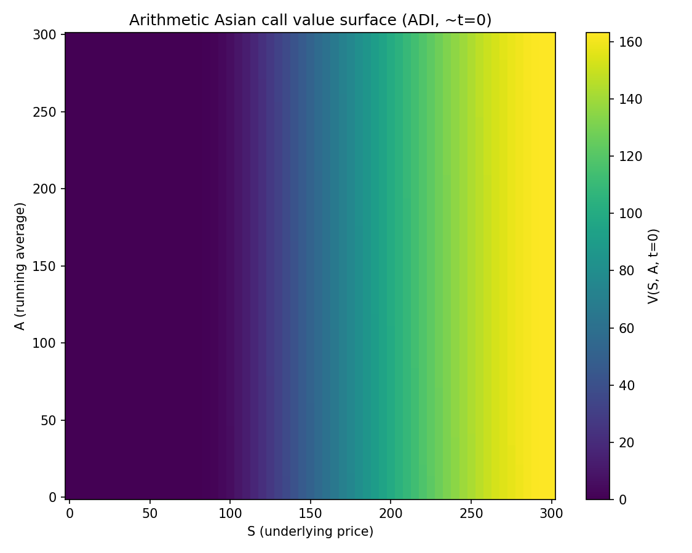

# Financial Instrument Pricing in C++

Five self-contained C++ programs implementing finite-difference and linear-complementarity
techniques for option pricing PDEs, following Duffy, *Financial Instrument Pricing Using C++*.
Where the rest of this repository favors Python/NumPy vectorization, these problems are structural:
tridiagonal factorizations, coupled implicit systems, and complementarity constraints that are
naturally expressed as explicit loops and linear-algebra routines written directly against the
underlying arrays, with no external numerical library.

## Projects

| Folder | Covers |
|---|---|
| [`tridiagonal-solvers/`](tridiagonal-solvers/) | LU factorization and Godunov's double-sweep method for tridiagonal linear systems, the workhorse solve behind every implicit scheme below |
| [`keller-box-black-scholes/`](keller-box-black-scholes/) | The Keller Box (implicit, box) scheme for the Black-Scholes PDE, via the first-order auxiliary system `W = ∂V/∂S` |
| [`exponentially-fitted-scheme/`](exponentially-fitted-scheme/) | Il'in's exponentially fitted finite-difference scheme, avoiding spurious oscillation in convection-dominated (high-Péclet) regimes |
| [`american-option-lcp-psor/`](american-option-lcp-psor/) | American option pricing as a linear complementarity problem, solved by projected SOR and by the direct Brennan-Schwartz sweep |
| [`adi-two-factor-asian-option/`](adi-two-factor-asian-option/) | Alternating-direction-implicit (ADI) scheme for the two-factor (price + running average) Asian option PDE |

## Performance

Every scheme here is built on the `O(J)` tridiagonal solve in `tridiagonal-solvers/`, and each
project uses the lowest-complexity correct algorithm for its own problem rather than a more generic
but costlier one: `keller-box-black-scholes/` solves its per-timestep system with an `O(J)` 2x2-block
generalization of that same tridiagonal solve (a dense solve of the identical system, kept only as an
`O(J^3)` cross-check, is never in the timed path), and `american-option-lcp-psor/` solves its
complementarity problem with a direct `O(N)` sweep (Brennan-Schwartz) alongside the iterative `O(N *
iters)` PSOR method, rather than relying on iteration alone. `adi-two-factor-asian-option/` stores its
2D grid in one contiguous, row-major buffer instead of a nested per-row allocation, so both of ADI's
sweep directions stay cache-local. Every one of these choices is cross-checked against an independent
reference (a dense solve, an iterative solver, or a Monte Carlo simulation) rather than taken on faith
that "faster" and "correct" coincide — see each subfolder's own "Computational complexity" section for
the exact operation counts and measured speedups.

## Visual examples

Each program writes its key numerical result to a `.csv`, which a small per-subfolder
`plot_results.py` script (matplotlib, run once to produce the `.png`) turns into a plot — this
post-processing step is the only place Python touches this folder; every pricing computation
itself is pure C++.

| Project | Plot |
|---|---|
| `tridiagonal-solvers/` |  |
| `keller-box-black-scholes/` |  |
| `exponentially-fitted-scheme/` |  |
| `american-option-lcp-psor/` |  |
| `adi-two-factor-asian-option/` |  |

See each subfolder's own README for the full interpretation of what each plot shows.

## How to build and run

Each subfolder contains a single `.cpp` file with no dependencies beyond the C++17 standard
library. Build with any C++17 compiler, e.g.:

```
g++ -O2 -std=c++17 -Wall <file>.cpp -o <output>
```

and run the resulting executable; each program prints its own diagnostic output directly to
`stdout` and, where noted in the subfolder's `README.md`, writes a `.csv` of the computed grid.
