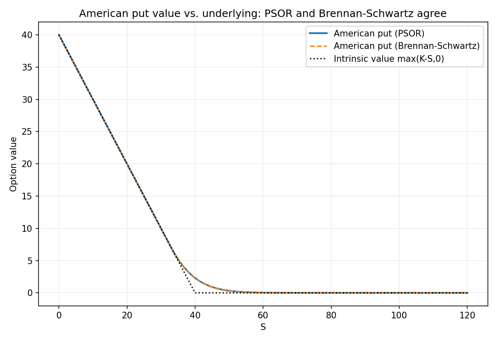

# American Option Pricing via Linear Complementarity and Projected SOR

## Problem

Under the risk-neutral measure `Q`, let `S` follow geometric Brownian motion `dS = rS dt + σS dW^Q`
on a filtered probability space `(Ω, F, (F_t), Q)`. The value of an American put with strike `K` and
maturity `T` is the optimal-stopping functional

```
V(S, t) = sup_{τ ∈ T_{t,T}} E^Q[ e^{-r(τ-t)} (K - S_τ)^+ | S_t = S ]
```

where `T_{t,T}` is the set of `(F_t)`-stopping times valued in `[t, T]`. This is not itself a PDE, but
a classical result in the theory of optimal stopping and variational inequalities (Bensoussan &
Lions, 1982; Jaillet, Lamberton & Lapeyre, *Variational inequalities and the pricing of American
options*, Acta Applicandae Mathematicae, 1990) identifies `V` as the unique viscosity (and, on the
interior of the continuation region, classical) solution of the obstacle problem

```
min( -∂V/∂t - L V,  V - payoff ) = 0,     L V ≡ ½σ²S²V_SS + rS V_S - rV,     payoff(S) = (K-S)^+
```

subject to `V(S,T) = payoff(S)`. Equivalently, `V ≥ payoff` everywhere, `-∂V/∂t - LV ≥ 0` everywhere,
and the two are complementary: on the continuation region `{V > payoff}` the Black-Scholes PDE holds
with equality, and on the exercise region `{V = payoff}` the PDE operator is (weakly) violated in the
direction consistent with early exercise being optimal. Time-discretizing this obstacle problem turns
each time slice into a genuine **linear complementarity problem (LCP)**.

## Method

**Spatial and temporal discretization.** The operator `L` is discretized with standard central
differences on a uniform grid `S_i = i·ΔS`, `i = 0,…,N`. Time-stepping uses **backward (implicit)
Euler**, not Crank-Nicolson — deliberately. The resulting one-step operator `A = I - Δτ·L_h` is
strictly diagonally dominant with non-positive off-diagonal entries for every `Δτ > 0` (an M-matrix),
which yields a discrete maximum principle and hence a monotone scheme. This matters specifically here
because the terminal condition `(K-S)^+` is not smooth at `S = K`: Crank-Nicolson's amplification
factor for high-frequency error modes does not stay uniformly below 1 as the mode number grows, and
is well documented (Rannacher, 1984, *Numerische Mathematik*) to produce spurious oscillations near a
non-smooth initial condition unless the first few steps are damped separately. Backward Euler avoids
that failure mode outright, at the cost of first-order (rather than second-order) accuracy in time —
made up for here with a fine time grid.

**The LCP.** Writing `x = V^{n+1}`, `c_i = payoff(S_i)`, and `b = V^n` (with the two boundary rows of
`A` and `b` overridden by the Dirichlet closure below), each time step requires finding

```
x ≥ c,     A x ≥ b,     (x - c)ᵀ(A x - b) = 0.
```

This is solved by **Projected SOR (PSOR)** (Cryer, *Successive overrelaxation methods for solving
linear complementarity problems arising from free boundary problems*, 1979): a Gauss-Seidel sweep
with over-relaxation, projected onto the feasible set after every component update,

```
y_j = (1/a_jj) · ( b_j − Σ_{i<j} a_ji x_i^{(k+1)} − Σ_{i>j} a_ji x_i^{(k)} )
x_j^{(k+1)} = max( c_j,  x_j^{(k)} + ω·(y_j − x_j^{(k)}) )
```

repeated to a fixed-point tolerance. Because `A` is an M-matrix, Cryer's theorem guarantees PSOR
converges monotonically to the LCP solution for any `ω ∈ (0, 2)`; `ω = 1.5` is used here.

**A direct alternative: Brennan & Schwartz (1977).** PSOR is iterative because it makes no special use
of the tridiagonal structure of `A` beyond a Gauss-Seidel sweep; but for a *tridiagonal* M-matrix LCP,
Brennan & Schwartz showed the exact solution can be recovered in a single forward/backward sweep, with
no relaxation at all. Forward-eliminate exactly as in the unconstrained Thomas algorithm (`tridiagonal-
solvers/`) to reduce `A` to upper-bidiagonal form; then, in the back-substitution, apply the obstacle
projection directly at each step, `x_i = max((rhs_i - sup_i x_{i+1})/diag_i,\ c_i)`, working from `i=N`
down to `0`. The M-matrix property that lets Cryer's theorem guarantee PSOR converges is the *same*
property that makes this direct, projected back-substitution recover the LCP solution exactly (Brennan
& Schwartz's original proof; see also Duffy, *Financial Instrument Pricing Using C++*, §21.3, and
Wilmott, Dewynne & Howison, *Option Pricing*, §8.8). `solveBrennanSchwartz` implements this and is run
end-to-end as an entirely independent second simulation, cross-checked against PSOR (see "Example
output").

**Boundary conditions.** `V(0,t) = K`: under this diffusion `S = 0` is an absorbing state
(`dS = 0` there), so the asset value never recovers and immediate exercise is optimal for all `t`.
`V(S_max, t) = 0` for `S_max` well past `K`, the standard deep-out-of-the-money truncation.

## Computational complexity

PSOR costs `O(N)` per relaxation sweep (one Gauss-Seidel pass over the grid), repeated until the
per-step tolerance is met — so its per-time-step cost is `O(N * iters)`, with `iters` a data-dependent
quantity bounded only by `maxPsorIter`, not a fixed constant. Brennan-Schwartz costs exactly `O(N)` per
time step, full stop — one forward pass and one backward (projected) pass, no relaxation loop at all.
Measured on the grid used here (`N=360` spatial nodes, `M=2000` time steps, `ω=1.5`, tolerance
`1e-9`): PSOR needs `37{,}965` total relaxation sweeps across the `2000` steps (≈19 per step, not the
`1` a non-iterative method needs), and wall time is `13.9x` longer than Brennan-Schwartz for numerically
indistinguishable output (see below) — the gap that "`O(N)` per iteration" vs. "`O(N)`, period" predicts.

## Files

| File | Contents |
|---|---|
| `american_option_lcp_psor.cpp` | Grid setup, PSOR solver, the direct Brennan-Schwartz solver, and a European closed-form cross-check |
| `american_put_value.csv` | `V(S, 0)` under both PSOR and Brennan-Schwartz, alongside the intrinsic value, over the economically relevant range of `S` |
| `plot_results.py` | Reads the CSV and renders `american_put_value.png` (post-processing only — both solvers above are pure C++) |

## How to build and run

```
g++ -O2 -std=c++17 -Wall -o american_option_lcp_psor american_option_lcp_psor.cpp
./american_option_lcp_psor
```

## Example output

For `K=40`, `r=0.06`, `σ=0.20`, `T=1`, `S0=36` (chosen to coincide with the parameters already used
for the Longstaff-Schwartz least-squares Monte Carlo estimate in
[`longstaff-schwartz-lsmc/`](../../longstaff-schwartz-lsmc/)):

| Method | Price |
|---|---|
| American put — LCP/PSOR | **4.484873** |
| American put — LCP/Brennan-Schwartz (direct) | **4.484414** |
| American put — Longstaff-Schwartz Monte Carlo (sibling project) | 4.473 |
| European put — Black-Scholes closed form | 3.844308 |

Four structurally unrelated routes to the same number — two different solutions of the identical LCP
(one iterative, one direct), a regression-based Monte Carlo simulation, and a closed-form formula —
agree to within a few thousandths on the early-exercise premium (`0.64` here), which is exactly the
cross-validation a single method cannot provide on its own. PSOR and Brennan-Schwartz agree with each
other to `5.3e-4` over the whole grid (the residual gap is PSOR's own `1e-9` per-step relaxation
tolerance accumulating over `2000` steps, not a difference in what LCP each is solving), while
Brennan-Schwartz reaches it in `13.9x` less wall time. The American price exceeds the European price
everywhere, as it must: the American contract's payoff set is a superset of the European one's (any
stopping time is available, including `τ = T`), so `V^{American} ≥ V^{European}` pointwise.



The PSOR and Brennan-Schwartz curves are visually indistinguishable everywhere, and both sit
strictly above the dotted intrinsic-value line except in the deep-in-the-money region where early
exercise is optimal and the option value equals its intrinsic value exactly — the free boundary
between the continuation and exercise regions is the point where the solid and dotted curves meet.
