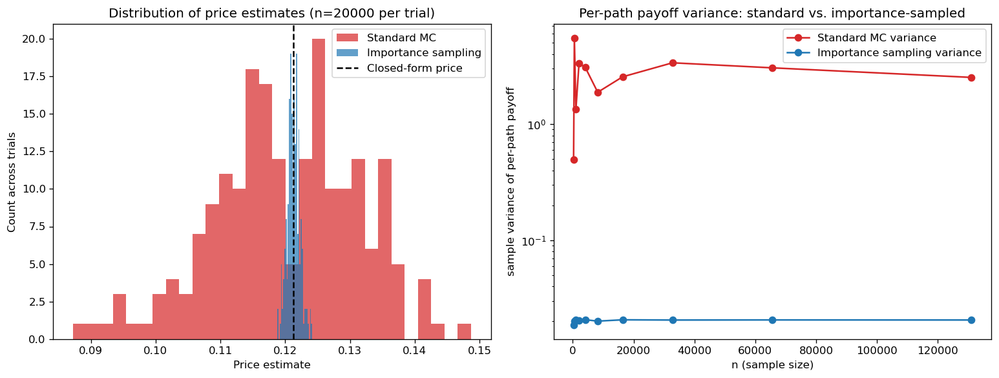

# Variance Reduction via Importance Sampling (Girsanov's Theorem)

## Problem

Price a deep out-of-the-money European call option under Black-Scholes (`K ≫ S_0`), where standard
Monte Carlo wastes nearly all its samples on paths that finish with zero payoff, giving a high
relative variance for a fixed sample size. Importance sampling, using a drift shift justified by
Girsanov's theorem, concentrates simulated paths where the payoff is actually nonzero and corrects
for the resulting bias with a likelihood-ratio weight.

## Method

Under the risk-neutral measure `P`, `Z ~ N(0,1)` and the discounted payoff is
`f(Z) = e^{-rT} max(S_0 e^{(r-σ²/2)T + σ√T Z} - K, 0)`, so the price is `E_P[f(Z)]`. Girsanov's
theorem states that shifting the driving normal by a constant `θ` (sampling `Z' = Z + θ` under a
new measure `Q`) changes its density by the likelihood ratio
`dP/dQ(z) = exp(-θz + θ²/2)`, so `E_P[f(Z)] = E_Q[f(Z)·dP/dQ(Z)]`: draw standard normals, shift by
`θ`, evaluate the payoff at the shifted value, and reweight by the likelihood ratio to keep the
estimator unbiased.

The shift `θ*` is chosen so the shifted distribution's mean lands at the point where the option is
just at-the-money (`S_T = K`), concentrating samples where the payoff is nonzero:

```
θ* = ( ln(K/S_0) - (r - σ²/2)T ) / (σ√T)
```

## Computational complexity

Per-path cost is `O(1)` and identical in order to standard Monte Carlo — one extra `exp()`
evaluation for the likelihood-ratio weight, no extra random draw and no extra simulation step — so
importance sampling's payoff is not a cheaper per-sample cost but a smaller **sample count for the
same target accuracy**: an estimator with per-path variance reduced by a factor `V` needs `1/V`
times as many paths for the same confidence-interval half-width, so the measured `~136x` variance
reduction is, in cost terms, a `~136x` reduction in the simulation budget needed to reach a given
precision on this deep-OTM price — precisely the regime where crude Monte Carlo is least efficient,
since almost every path contributes a zero payoff and the sample average is dominated by
estimator noise rather than signal. The outer repeated-trial loop (`200` trials of `n=20,000`
each, used only to *measure* this variance-reduction factor empirically) is already
`O(n_trials x n)` total work with each trial internally vectorized across its `n` paths; the
Python-level loop over `n_trials` is not a bottleneck here — the per-trial vectorized cost
dominates it by several orders of magnitude, so batching all trials into one `(n_trials, n)` array
would remove negligible constant-factor overhead at the cost of a less readable estimator-comparison
loop, and was intentionally not done.

## Files

| File | Contents |
|---|---|
| `importance_sampling_girsanov.ipynb` | Single-run comparison, repeated-trial variance estimate, and plots |
| `importance_sampling_variance_reduction.png` | Distribution of price estimates across trials, and per-path payoff variance vs. sample size |

## How to build and run

Open `importance_sampling_girsanov.ipynb` in Jupyter Notebook/Lab or VS Code and run all cells in
order. Requires `numpy`, `matplotlib`, and `scipy`.

## Example output

For `S_0=100`, `K=160`, `r=0.03`, `σ=0.20`, `T=1` (closed-form price `0.1213`), only **1.06%** of
standard-sampling paths finish in-the-money, versus **50.15%** under the Girsanov-shifted measure.
A single run at `n=100,000` gives a per-path payoff variance of `2.466` (standard) vs. `0.0205`
(importance sampling) — a **120× reduction**. Across 200 independent trials of `n=20,000`, the
importance-sampling estimator's standard deviation is `9.7×10^-4` against standard MC's
`1.13×10^-2`, an empirical **136× variance reduction**, with both methods' means (`0.1213` and
`0.1202` respectively) consistent with the closed-form price.



The importance-sampling estimator's distribution across trials is visibly far tighter around the
closed-form price than standard Monte Carlo's — the direct visual counterpart of the 136× standard
deviation reduction measured above.
