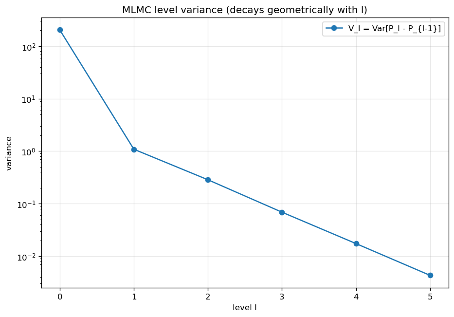
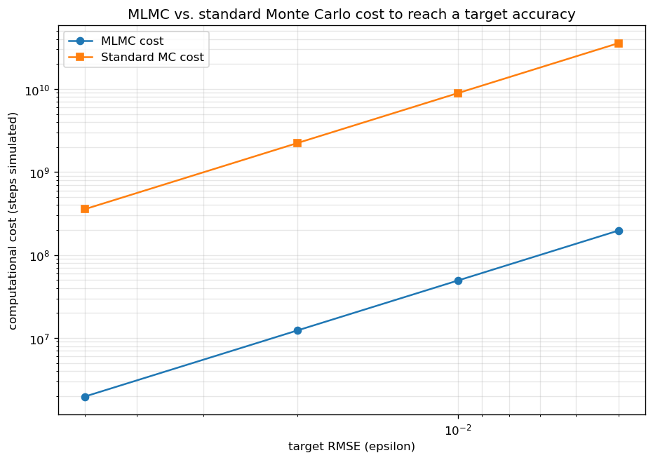

# Multilevel Monte Carlo (MLMC) Path Simulation

## Problem

Price a European call option under GBM (`dS = rS dt + σS dW`) by Monte Carlo simulation of an
Euler-Maruyama discretization of `S`, and compare the computational cost of reaching a target
root-mean-square accuracy `ε` via standard (single-level) Monte Carlo against Multilevel Monte
Carlo (MLMC).

## Method

A hierarchy of levels `l = 0, ..., L` uses time steps `dt_l = dt_0 · M^-l` (`M = 4`). The
discounted payoff `P = e^{-rT} max(S_T - K, 0)` is decomposed as a telescoping sum,
`E[P_L] = E[P_0] + Σ_{l=1}^{L} E[P_l - P_{l-1}]`, and each term is estimated independently:

- **Level 0**: `N_0` paths at the coarsest step, estimating `E[P_0]` directly.
- **Level l > 0**: `N_l` pairs of paths sharing the *same* Brownian path — a fine path at step
  `dt_l` and a coarse path at step `dt_{l-1} = M·dt_l`, built by summing every `M` consecutive fine
  Brownian increments into each coarse increment. Sharing the driving noise makes `P_l` and
  `P_{l-1}` strongly correlated, so `Var[P_l - P_{l-1}]` is far smaller than `Var[P_l]` alone —
  the coupling that makes MLMC work.

The number of samples `N_l` at each level is chosen to minimize total cost for a target variance
`ε²`, following Giles (2008): `N_l = ⌈2ε^-2 √(V_l/C_l) · Σ_l √(V_l C_l)⌉`, where
`V_l = Var[P_l - P_{l-1}]` and `C_l ∝ 1/dt_l` is the cost of one path at level `l`. `V_l` and `C_l`
are estimated from a pilot run before allocating the final sample budget.

## Computational complexity

This folder's method *is* a computational-complexity argument. A single-level Euler-Maruyama
estimator hitting a target RMSE `epsilon` needs its discretization bias `O(dt_L)` and its Monte
Carlo standard error `O(N^-1/2)` both below `epsilon`, forcing `dt_L = O(epsilon)` (so
`n_steps = O(epsilon^-1)`, since Euler-Maruyama's strong/weak order here is `1`) and
`N = O(epsilon^-2)` paths at that finest resolution — total cost `O(epsilon^-2) x O(epsilon^-1) =
O(epsilon^-3)`. MLMC (Giles 2008, the complexity theorem behind this notebook's cost comparison)
instead allocates `N_l = O(epsilon^-2 sqrt(V_l/C_l) sum_l sqrt(V_l C_l))` samples per level, putting
the bulk of the sample budget on cheap coarse levels (`C_l = O(M^l)`) and only a handful of samples
on the expensive fine ones, because `V_l = Var[P_l - P_{l-1}] = O(dt_l)` decays geometrically (the
`~4x` per-level reduction measured here, matching `M=4`) while `C_l` grows geometrically in the
*same* ratio — when `V_l C_l` is roughly constant across levels this way, the total MLMC cost for
RMSE `epsilon` is `O(epsilon^-2)`, a full inverse power of `epsilon` cheaper than standard MC's
`O(epsilon^-3)`. The measured `~180x` speedup at the tested accuracies is this asymptotic gap
showing up at finite `epsilon`, not a coincidence of the specific parameters chosen.

## Files

| File | Contents |
|---|---|
| `multilevel_monte_carlo.ipynb` | Level variance/cost estimation, optimal sample allocation, and cost comparison |
| `mlmc_level_variance.png` | `V_l` vs. level (geometric decay) |
| `mlmc_vs_standard_cost.png` | Total computational cost, MLMC vs. standard MC, across target accuracies |

## How to build and run

Open `multilevel_monte_carlo.ipynb` in Jupyter Notebook/Lab or VS Code and run all cells in order.
Requires `numpy`, `matplotlib`, and `scipy`.

## Example output

For `S_0=100`, `K=100`, `r=0.05`, `σ=0.20`, `T=1` (closed-form price `10.4506`), the level
correction variance decays geometrically from level 1 onward — `1.087`, `0.285`, `0.0687`,
`0.0173`, `0.0043` — a ~4× reduction per level, matching the `O(dt)` variance scaling expected from
an Euler-Maruyama discretization under `M=4`. (Level 0's variance, `204.1`, is the raw payoff
variance rather than a level correction, and is not part of that geometric trend.)

MLMC estimates across four target accuracies (`ε = 0.05, 0.02, 0.01, 0.005`) all land within
`0.01` of the closed-form price (`10.4642`, `10.4367`, `10.4413`, `10.4495`), and the computational
cost comparison shows a consistent **~180× speedup** over standard Monte Carlo at every target
accuracy — the central result MLMC is designed to deliver, since standard MC's cost to hit a given
`ε` grows as `O(ε^-2)` at the finest level's per-path cost, while MLMC reaches the same `ε` mostly
from cheap, coarse-level samples.

The cost plot's growing gap between the two curves as `ε` shrinks is the `O(ε^-3)` vs. `O(ε^-2)`
asymptotic separation showing up directly, not just in the tabulated ~180× figure.
