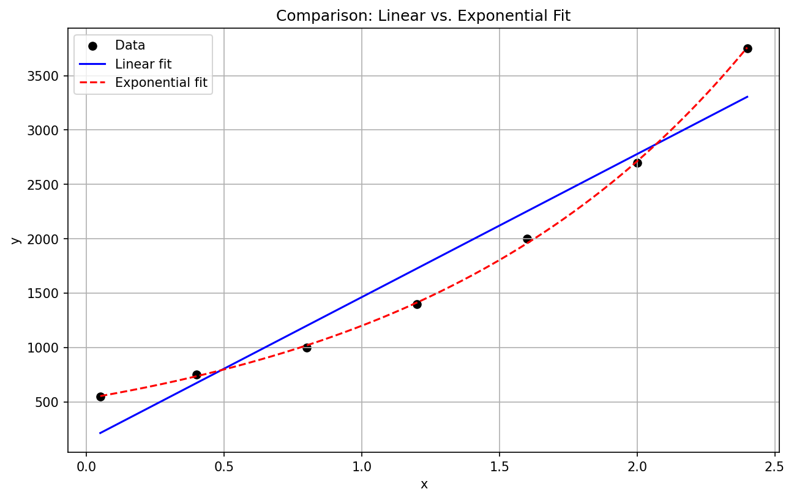
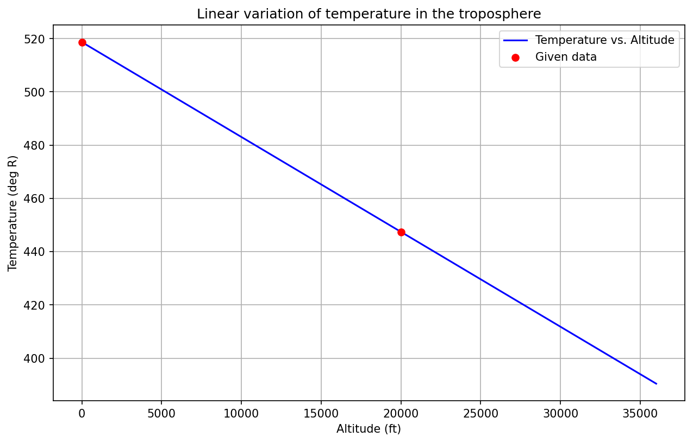
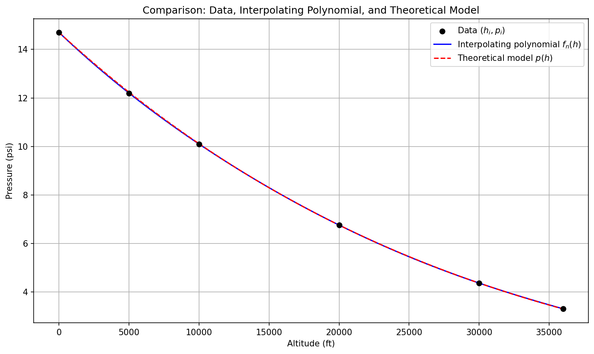

# Numerical Linear Algebra, Curve Fitting, and Interpolation

Two notebooks covering linear-algebra fundamentals implemented from scratch (no `numpy.linalg`
shortcuts for the core algorithms) and the standard curve-fitting/interpolation toolkit, including
a real dataset (atmospheric pressure vs. altitude) worked with both interpolation and regression.

## Notebooks

| Notebook | Covers |
|---|---|
| [`linear_algebra_methods_review.ipynb`](linear_algebra_methods_review.ipynb) | Determinant, inverse, Gram-Schmidt-style orthogonalization, LU factorization, a linear system, curve fitting, and two interpolation methods |
| [`linear_systems_curve_fitting.ipynb`](linear_systems_curve_fitting.ipynb) | Gauss/Gauss-Jordan/Gauss-Seidel linear systems, determinant/inverse/LU for two larger matrices, Gram-Schmidt for three vector sets, and curve fitting/interpolation applied to an atmospheric dataset |

## How to run

Each notebook is self-contained: open it in Jupyter Notebook/Lab or VS Code and run all cells in
order. Requires `numpy`, `pandas`, and `matplotlib`. Cells that prompt for matrix/vector entries or
an initial guess via `input()` need values typed in when run interactively.

## Computational complexity

Every algorithm below is implemented on plain nested Python lists rather than vectorized `numpy`
arrays, by design (see "Two notebooks..." above): the point of this folder is the algorithm's own
arithmetic, not a BLAS call, so the loops are left as loops rather than rewritten into equivalent
`numpy` expressions that would obscure exactly what is being computed. For an `n x n` matrix or an
`n`-vector system:

- **Determinant via recursive cofactor expansion** costs `O(n!)` scalar multiplications — each
  level of recursion expands into `n` subproblems of size `n-1`, with no memoization across the
  repeated minors. This is not a scalable algorithm (`8! = 40{,}320`, already the largest case
  tested here; `20!\approx2.4\times10^{18}` would be hopeless) and is *not* how `det(A)` should be
  computed in general — the LU factorization elsewhere in this same notebook gives `det(A) =
  \prod_i U_{ii}` (up to a pivoting sign) in `O(n^3)`. Cofactor expansion is used here specifically
  because it is the definition of the determinant made computational, at a size small enough
  (`n\le8`) that the factorial cost is invisible.
- **Gauss-Jordan elimination (for the inverse), plain Gaussian elimination (for a linear system),
  and LU factorization** are all `O(n^3)` — three nested loops over rows, columns, and the
  elimination target — with back-substitution (where applicable) an additional `O(n^2)`.
- **Gauss-Seidel iteration** costs `O(n^2)` *per iteration* (one sweep over the coefficient
  matrix), with the number of iterations to reach a given tolerance governed by the spectral
  radius of the iteration matrix `M = -(D+L)^{-1}U` — not by `n` directly — which is why the
  notebook reports iteration counts at two different tolerances rather than asserting a fixed
  count.
- **The Gram-Schmidt-style orthogonalization** implemented here is deliberately *not* the
  classical sequential-projection algorithm (subtracting each new vector's projection onto every
  previously orthogonalized one, also `O(n^2 d)` for `n` vectors in `\mathbb R^d`); it instead
  forms the Gram matrix `G = VV^\top` (`O(n^2 d)` for `n` vectors in `d` dimensions) and recovers
  an orthogonal set by Gaussian-reducing `G` augmented with `V` (`O(n^3)`) — a different route to
  a mathematically equivalent kind of result, made explicit here rather than left for the reader to
  reconcile with the textbook algorithm of the same name.
- **Curve fitting** (linear/exponential least squares) is `O(n)`: the normal-equation sums
  `\sum x_i`, `\sum y_i`, `\sum x_i^2`, `\sum x_iy_i` are each one pass over the `n` data points,
  and the fitted coefficients are closed-form in those four numbers. **Newton's divided-difference
  table** for `k` interpolation points costs `O(k^2)` to build and `O(k)` to evaluate at a new
  point; **Lagrange interpolation**, evaluated directly from its defining product formula rather
  than the (algebraically equivalent, `O(k)`-per-evaluation) barycentric form, costs `O(k^2)` per
  evaluation — appropriate here since `k` is a handful of points, not a cost that would survive
  being called at many query points.

## Numerical linear algebra methods review

Six independent problems, each implemented from scratch:

1. **Matrix determinant** via recursive cofactor expansion, on a 5x5 matrix.
2. **Matrix inverse** via Gauss-Jordan elimination on an augmented `[A | I]` matrix, with partial
   pivoting.
3. **Orthogonal basis** via a Gram-Schmidt-style reduction: builds the Gram matrix `V·Vᵀ`,
   augments it with the original vectors, and reduces it with Gaussian elimination to recover an
   orthogonal set.
4. **LU factorization** without pivoting, verified by reconstructing `L·U` and comparing it to the
   original matrix.
5. **Linear system solving** via Gaussian elimination with back-substitution.
6. **Curve fitting and interpolation** on a shared dataset
   (`x = [0.05, 0.4, 0.8, 1.2, 1.6, 2, 2.4]`, `y = [550, 750, 1000, 1400, 2000, 2700, 3750]`):
   linear vs. exponential least-squares fits compared by R², Newton's divided-difference
   interpolation using the 4 nearest neighbors to `x = 1.5`, and Lagrange interpolation evaluated
   at a user-supplied point.

The exponential curve visibly tracks the data's upward-accelerating shape more closely than the
straight line, consistent with its higher `R²` in the printed output — the plot makes concrete
what the correlation coefficient alone only summarizes numerically.

## Linear systems, curve fitting, and interpolation

**Part 1 — Linear systems of equations.**

- A 6-unknown system solved by Gauss elimination.
- A 6-unknown system solved by Gauss-Jordan elimination.
- A 3-unknown system solved by Gauss-Seidel iteration at tolerances `1e-2` and `1e-6`, with the
  results substituted back into the system to compare residuals.
- Determinant, inverse, and LU factorization (no pivoting) for a 6x6 and an 8x8 matrix, each via
  recursive cofactor expansion and Gauss-Jordan elimination.
- Gram-Schmidt orthogonalization for three vector sets of increasing dimension (3, 4, and 4
  vectors).

**Part 2 — Curve fitting.**

- Two tabulated datasets fit and interpolated in the Taylor, Lagrange, and Newton polynomial
  bases, including evaluation at several query points.
- Linear, exponential, and power-law least-squares fits compared by correlation coefficient.
- A rational model `Y(x) = kx²/(c+x²)` linearized algebraically (`x²/Y = c/k + v/k`) and its
  parameters recovered via linear regression.
- **Atmospheric pressure vs. altitude in the troposphere:** given a linear temperature profile
  `T(h)` fit from two data points, and a pressure/altitude/speed-of-sound table from 0 to 36,000 ft,
  the notebook builds a Newton divided-difference table, selects a reduced-degree interpolating
  polynomial for pressure, compares it against a least-squares fit, and cross-checks both against
  the closed-form barometric relationship
  `p(h) = p(0)·(T(h)/T(0))^(-g/(aR))` to estimate pressure at 25,000 ft and report the
  discrepancy between the numerical and theoretical estimates.

The interpolating polynomial passes through every tabulated point exactly by construction, while
the theoretical barometric curve is fit independently from the temperature-lapse-rate physics —
the two curves tracking each other closely over the full altitude range is the cross-check that
the divided-difference interpolation is not just numerically consistent but physically sensible.
