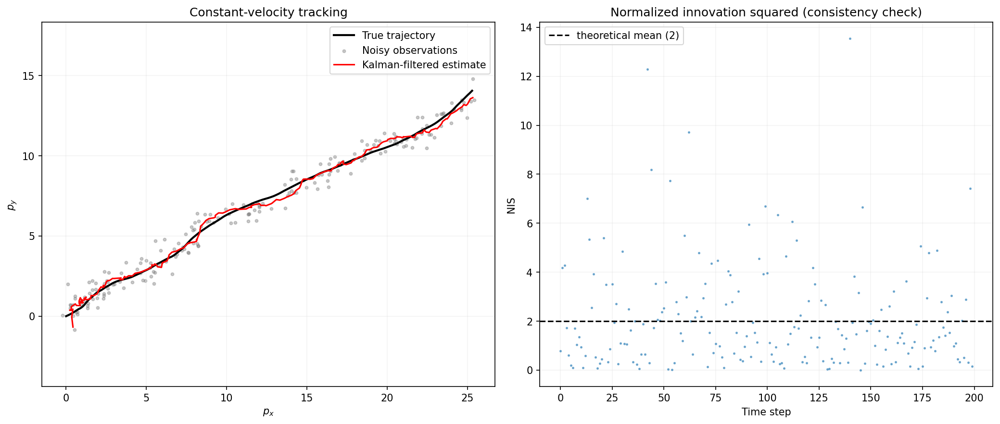
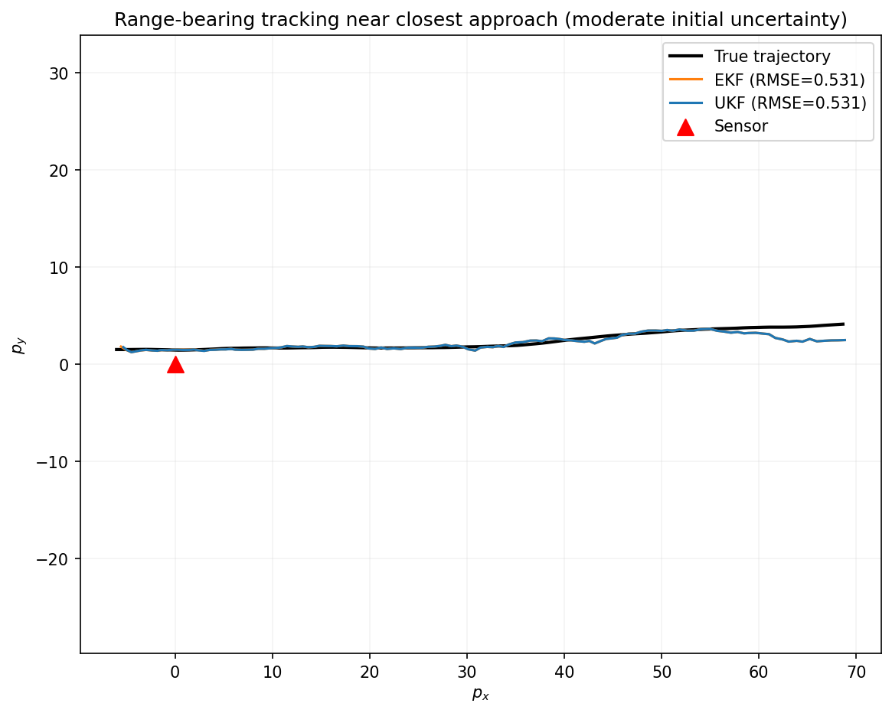
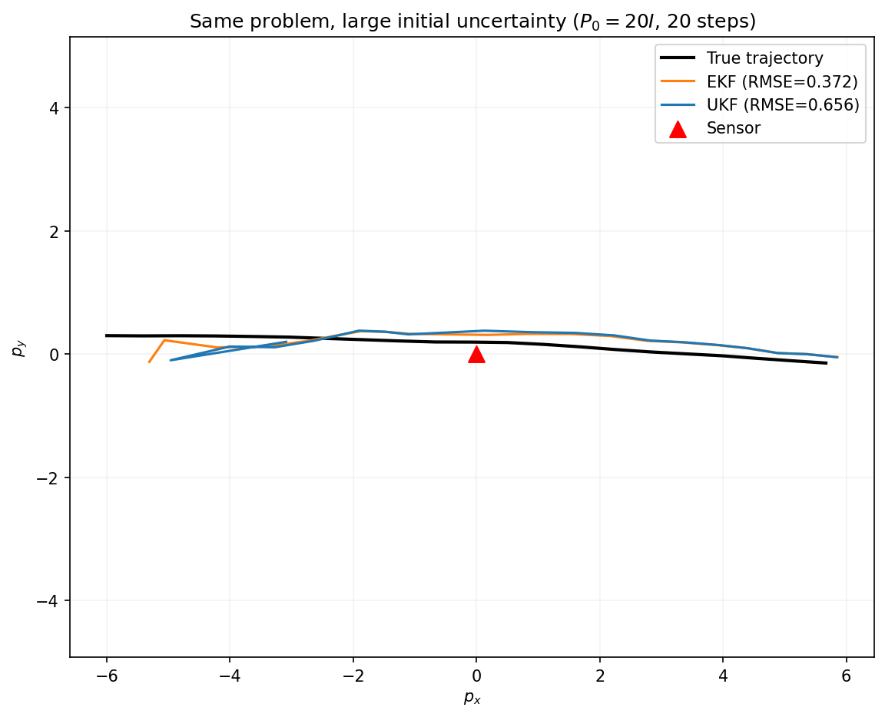
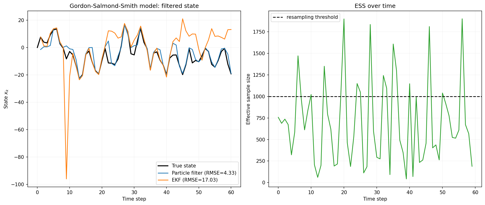
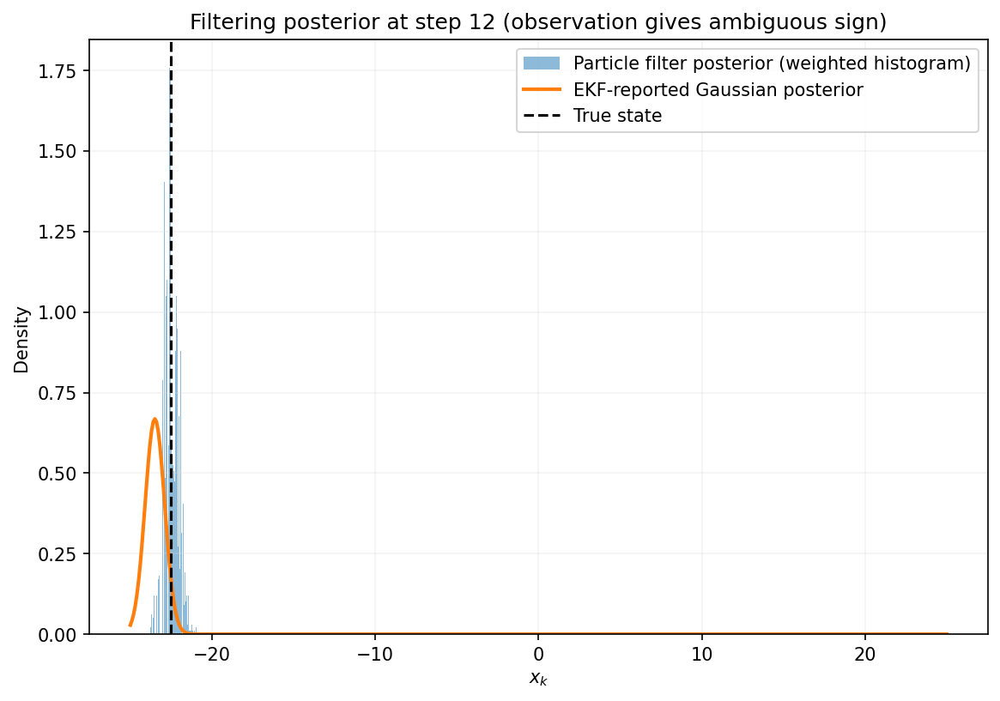
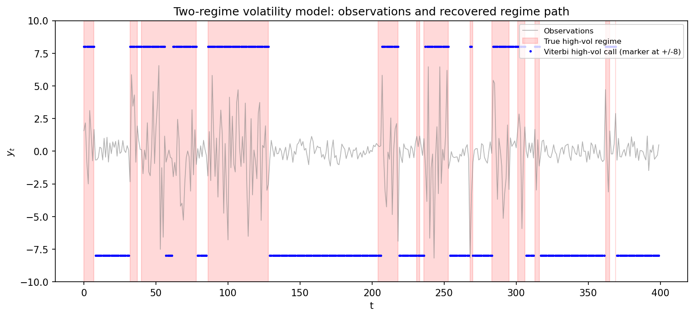
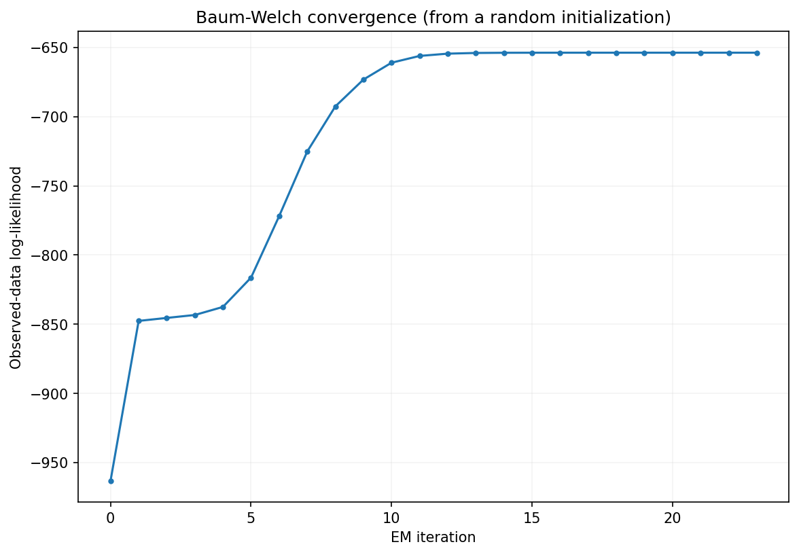

# Sequential Bayesian Filtering

Four notebooks on recursive state estimation from noisy sequential observations, moving from the
one case with an exact closed-form solution through the two standard approximations for
nonlinearity to the two structurally different representations — a particle ensemble and a
discrete-state posterior — needed when a single Gaussian is the wrong shape for the problem
entirely.

## Notebooks

| Notebook | Covers |
|---|---|
| [`kalman_filter.ipynb`](kalman_filter.ipynb) | The linear-Gaussian Kalman filter, derived from joint Gaussian conditioning, with a normalized-innovation-squared consistency check on constant-velocity tracking |
| [`extended_and_unscented_kalman_filter.ipynb`](extended_and_unscented_kalman_filter.ipynb) | EKF (Jacobian linearization) vs. UKF (the unscented transform) on nonlinear range-bearing tracking, including a regime where the UKF measurably underperforms |
| [`particle_filter.ipynb`](particle_filter.ipynb) | The bootstrap particle filter (sequential importance sampling, systematic resampling, effective sample size) on the Gordon-Salmond-Smith benchmark, whose posterior is genuinely bimodal |
| [`hidden_markov_model.ipynb`](hidden_markov_model.ipynb) | Forward-backward, Viterbi, and Baum-Welch (EM) for discrete-state HMMs, on a two-regime volatility model |

## How to build and run

Each notebook is self-contained: open it in Jupyter Notebook/Lab or VS Code and run all cells in
order. Requires `numpy`, `scipy`, and `matplotlib`. Every filter is implemented directly from its
update equations — no `filterpy`, `pykalman`, or `hmmlearn`.

## Kalman filter

Derives the predict step from linear propagation of a Gaussian and the update step from the
conditional-Gaussian (Schur complement) formula applied to the joint law of the state and the
observation — the Kalman gain is exactly the conditioning formula's cross-covariance term, not a
separately motivated quantity. On constant-velocity tracking with position-only observations, the
filtered estimate's RMSE is well below the raw observation noise, and the mean normalized
innovation squared falls inside its theoretical 95% band — confirming the filter's reported
covariance is calibrated, not just that the trajectory looks visually close to the truth.

## Extended vs. unscented Kalman filter

Derives the EKF's Jacobian-linearized update and the UKF's sigma-point unscented transform, then
tests both, honestly, on nonlinear range-bearing tracking. At moderate initial uncertainty the two
are statistically indistinguishable on this problem. At a deliberately inflated initial covariance,
the result reverses the textbook expectation: the EKF beats the UKF by a reproducible margin,
because the UKF's sigma points end up sampling near the range-bearing observation's singularity at
the sensor, where the unscented transform's local-accuracy guarantee no longer applies — a
diagnosed failure mode, not an unexplained anomaly, and a reminder that "uses more information
about the nonlinearity" is not the same claim as "is more accurate." The observation model is
evaluated at all $2n+1$ sigma points in one vectorized array expression rather than one Python
function call per point.

Both trajectories look close to the truth in the first plot; the second makes the failure mode
visible — the UKF's estimate visibly drifts further from the true path than the EKF's as the sigma
points sample too close to the sensor.

## Particle filter

Derives sequential importance sampling and the bootstrap filter's simplified weight update, then
systematic resampling's lower-variance property relative to multinomial resampling. On the
Gordon-Salmond-Smith nonlinear growth model — chosen because its posterior is genuinely bimodal at
every step — the particle filter's RMSE (4.33) is roughly 4x lower than an EKF run on the same
data (17.03), and a direct snapshot of the filtering posterior at an ambiguous-sign observation
shows the particle filter's weighted histogram capturing both modes while the EKF reports a single
Gaussian centered at one of them — a structural difference in what each filter can represent, not
just a difference in point-estimate accuracy.

The second plot is the central result made visible: the true state (dashed line) sits under one of
two particle-filter modes, while the EKF's single Gaussian is forced to commit to a compromise
between them.

## Hidden Markov models

Derives the forward-backward recursions, the Viterbi max-product recursion, and the Baum-Welch
EM updates (E-step posteriors, M-step closed forms) from the expected complete-data
log-likelihood. On a two-regime volatility model where both regimes share a mean and differ only
in dispersion, Viterbi recovers the true regime path with 94% accuracy, and Baum-Welch, started
from a random initialization with no knowledge of the true parameters, recovers a transition
matrix and per-regime volatilities close to the ground truth (after resolving EM's inherent
label-permutation ambiguity) — with the observed-data log-likelihood confirmed non-decreasing at
every iteration, a direct, checkable consequence of the EM ascent property rather than an assumed
one. The E-step's pairwise-state accumulator $\xi_{\mathrm{sum}}(i,j)=\sum_{t=1}^{T-1}\xi_t(i,j)$
is computed as a single $K\times K$ matrix product against a $(T-1)\times K$ array, rather than as
a $T-1$-iteration Python loop over the same sum — identical arithmetic, carried out as one
BLAS-backed matrix multiply instead of many small interpreted steps, which matters because this
sum is recomputed once per EM iteration.

The log-likelihood curve is the direct visual check of the EM ascent property claimed above: it
rises monotonically (up to floating-point noise) rather than merely trending upward on average.

## Computational complexity

Let $n$ denote the state dimension, $m$ the observation dimension, $T$ the number of time steps,
$N$ the particle count, and $K$ the number of discrete HMM states.

**Kalman filter.** Each step is $O(n^3)$ from the state-covariance propagation
$F P F^\top$ and $O(m^3)$ from inverting the innovation covariance $S$ ($n=4$, $m=2$ here, so the
state term dominates); total cost over the filter is $O(Tn^3)$. The recursion is inherently
sequential in $T$ — step $k+1$ needs step $k$'s posterior — so the code vectorizes only within a
step (matrix operations on $n\times n$ and $m\times m$ blocks), not across time.

**EKF vs. UKF.** The EKF pays $O(n^3)$ per step for one Jacobian evaluation plus the same
covariance propagation and $S$-inversion as the linear filter. The UKF forms $2n+1$ sigma points
via one Cholesky factorization of $P$ ($O(n^3)$), propagates each point through the (nonlinear,
but here algebraically cheap) dynamics and observation model at $O(n)$ per point — vectorized
across all $2n+1$ points — and then reconstructs the predicted mean/covariance via weighted outer
products, $O(n^3)$ again for the $(2n+1)\times n$ contraction. Both filters are therefore the same
asymptotic order, $O(n^3)$ per step; the UKF's larger constant factor (one Cholesky plus $2n+1$
propagations and two more $O(n^3)$-scale contractions per step, against the EKF's single Jacobian)
is the price paid for not linearizing, and the notebook's point is precisely that this extra cost
does not universally buy extra accuracy.

**Particle filter.** $O(N)$ per step for the propagation and weight update, fully vectorized
across particles (embarrassingly parallel — no particle's update depends on another's within a
step) — $N=2000$ here. Systematic resampling is $O(N)$ for the cumulative-sum construction plus
$O(N\log N)$ for the `searchsorted` lookup, triggered only when the effective sample size drops
below the threshold rather than at every step, so its amortized cost is well below the worst-case
$O(N\log N)$ per step.

**HMM.** Forward-backward is $O(K^2T)$ (a $K\times K$ transition applied at every one of $T$
steps); Viterbi is the same $O(K^2T)$ with a max in place of a sum. Baum-Welch repeats one
forward-backward pass plus the $\xi$-accumulation (also $O(K^2T)$, vectorized as described above)
per EM iteration, for a total of $O(K^2T\cdot\text{iterations})$ — at $K=2$, $T=400$, well under
200 iterations, this is cheap regardless of implementation, but the vectorized $\xi$-accumulation
is the difference between one BLAS call and hundreds of thousands of interpreted Python steps at
realistic $T$.
