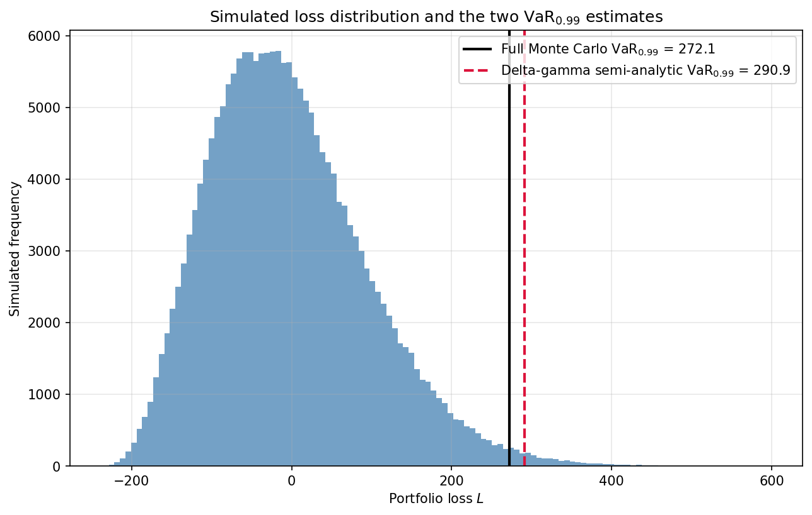

# Value-at-Risk via the Delta-Gamma Approximation

Estimation of a nonlinear derivatives portfolio's Value-at-Risk under the physical (statistical)
measure, using a quadratic delta-gamma approximation to accelerate a Monte Carlo tail estimator.

## Problem

Let $(\Omega,\mathcal F,P)$ be the physical probability space governing the evolution of an
underlying price vector $S=(S_1,\dots,S_m)$, and fix a risk horizon $\Delta t$. The change
$\Delta S = S(t+\Delta t)-S(t)$ is an $\mathcal F_{t+\Delta t}$-measurable random vector, and a
portfolio with value process $V(S(t),t)$ has loss

$$
L = -\Delta V = -\big(V(S(t)+\Delta S,\,t+\Delta t) - V(S(t),t)\big).
$$

For $p\in(0,1)$, the Value-at-Risk is the $(1-p)$-quantile of the loss distribution,
$\mathrm{VaR}_p = \inf\{x : P(L>x)\le p\}$. When $V$ is nonlinear in $S$ — as it is for any book
containing options — the exact law of $L$ has no closed form, and $\mathrm{VaR}_p$ must be
estimated numerically. This project follows Glasserman, *Monte Carlo Methods in Financial
Engineering*, §9.1–9.2.

## Method

**Portfolio.** $m=10$ independent underlyings, each with $\sigma_j=0.40$; the book is short 10
at-the-money calls and short 5 at-the-money puts on each, all with $T=0.10$ years to expiry,
under a $\Delta t = 0.04$-year (≈2-week) risk horizon — the configuration behind Glasserman's
Figure 9.1. Since every option references only its own underlying, the portfolio's Hessian
$\Gamma$ is diagonal in this instance; this is a property of the example, not of the method, and
the code diagonalizes $\Gamma$ generically (via `np.linalg.eigh`) rather than exploiting this
structure by hand.

**Delta-gamma approximation.** The second-order Taylor expansion of $\Delta V$ gives

$$
\Delta V \approx \frac{\partial V}{\partial t}\Delta t + \delta^\top\Delta S +
\tfrac12\Delta S^\top\Gamma\Delta S.
$$

Writing $\Delta S=\tilde C Z$ with $\tilde C\tilde C^\top=\Sigma_S$, $Z\sim N(0,I_m)$, and
orthogonally diagonalizing the symmetric matrix $-\tfrac12\tilde C^\top\Gamma\tilde C=U\Lambda U^\top$
gives, with $C=\tilde CU$, $b=-C^\top\delta$, $a=-\Delta t\,\partial V/\partial t$, the diagonal
representation

$$
L \approx Q := a + \sum_{j=1}^m\big(b_jZ_j+\lambda_jZ_j^2\big).
$$

**Exact tail probability of $Q$.** Each summand $b_jZ_j+\lambda_jZ_j^2$ is an affine transform of
a noncentral $\chi^2_1$ variable, so by independence the cumulant generating function of $Q$
factors in closed form:

$$
\psi(\theta)=a\theta+\tfrac12\sum_j\left(\frac{\theta^2b_j^2}{1-2\theta\lambda_j}-\log(1-2\theta\lambda_j)\right).
$$

The characteristic function $\widehat\varphi(u)=e^{\psi(iu)}$ is inverted via the Gil-Pelaez-type
integral $P(Q\le x)-P(Q\le x-y)=\tfrac1\pi\int_0^\infty\mathrm{Re}\big[\widehat\varphi(u)\tfrac{e^{iuy}-1}{iu}e^{-iux}\big]du$
(adaptive quadrature; $\widehat\varphi$ decays very fast away from $u=0$, so a coarse fixed grid
silently produces nonsense) to obtain $P(Q>x)$ for any $x$ **without simulation**, and hence a
semi-analytic delta-gamma VaR by root-finding on $P(Q>x)=p$.

**Full Monte Carlo.** Simulate $\Delta S\sim N(0,\Sigma_S)$, revalue the exact (non-approximated)
Black-Scholes portfolio at $S+\Delta S$, $T-\Delta t$, and take the empirical quantile of the
simulated losses.

**Control variate.** $Q$ is available at negligible cost per replication (closed-form in the same
$Z$ used to simulate $\Delta S$) and highly correlated with $L$. Following Glasserman eq. (9.9),

$$
1-\widehat F_L^{cv}(x)=\frac1n\sum_i\mathbf 1\{L_i>x\}-\widehat\beta\Big(\frac1n\sum_i\mathbf 1\{Q_i>y\}-P(Q>y)\Big),
$$

using the *exact* $P(Q>y)$ from the transform inversion (not simulated) and the empirical
variance-minimizing $\widehat\beta$. The attainable variance reduction is bounded by
$\rho^2$, where $\rho=\mathrm{Corr}(\mathbf 1\{L>x\},\mathbf 1\{Q>y\})$ — necessarily smaller
than $\mathrm{Corr}(L,Q)$ itself, since thresholding need not preserve correlation in the tails.

## Computational complexity

The diagonalization step (Cholesky of `Sigma_S` plus `eigh` of the `m x m` matrix `M`) is
`O(m^3)`, trivial at `m=10`. The semi-analytic route is then entirely simulation-free: `cgf` (and
hence `char_func`) is a closed-form sum of `m` terms evaluated at whatever quadrature node
`scipy.integrate.quad` requests, so one tail-probability evaluation costs `O(m)` per node times
whatever adaptive node count `quad` uses internally — no sampling noise, and no dependence on
`n_mc` at all, versus full Monte Carlo's `O(n_mc x m)` cost to revalue the exact portfolio at every
one of `n_mc=200,000` simulated scenarios. (The `m`-term loop inside `cgf` is left as a plain Python
loop rather than vectorized over `m`: at `m=10` elements, NumPy's per-call dispatch overhead exceeds
what vectorization would save, and the actual cost driver is `quad`'s adaptive node count, not this
loop — vectorizing it would not be a real optimization, only a cosmetic one.) The delta-gamma
approximation trades this simulation-free speed against approximation bias (visible in the gap
between the two VaR estimates, `272.14` vs. `290.89`), and the control-variate re-estimation of the
tail probability reuses the *same* `n_mc` scenarios already drawn for the full Monte Carlo run, at
`O(n_mc)` extra cost — no new random draws, exactly as in `control-variates/`.

## Files

| File | Contents |
|---|---|
| `value_at_risk_delta_gamma.ipynb` | Portfolio setup, diagonalization, transform inversion, full Monte Carlo, control-variate estimator |
| `var_loss_distribution.png` | Simulated loss histogram with both VaR₀.₉₉ estimates marked |

## How to build and run

Open `value_at_risk_delta_gamma.ipynb` in Jupyter Notebook/Lab or VS Code and run all cells in
order. Requires `numpy` and `scipy`.

## Example output

For the portfolio above, $\mathrm{Corr}(L,Q) = 0.9946$ — the quadratic approximation tracks the
true loss closely at this horizon. The two VaR estimates:

| Method | $\mathrm{VaR}_{0.99}$ |
|---|---|
| Full Monte Carlo ($n=200{,}000$) | 272.14 |
| Delta-gamma semi-analytic (transform inversion, no simulation) | 290.89 |

using $Q$ as a control variate to re-estimate $P(L>\mathrm{VaR}_{mc})$ (target $0.01$) achieves a
**5.98× variance reduction** over the naive indicator average — consistent with Glasserman's
reported typical range of a factor of 2–5 for this technique.

The gap between the two vertical lines is the delta-gamma approximation's bias at this horizon —
visually small relative to the spread of the loss distribution itself, consistent with the
`Corr(L,Q) = 0.9946` reported above.
